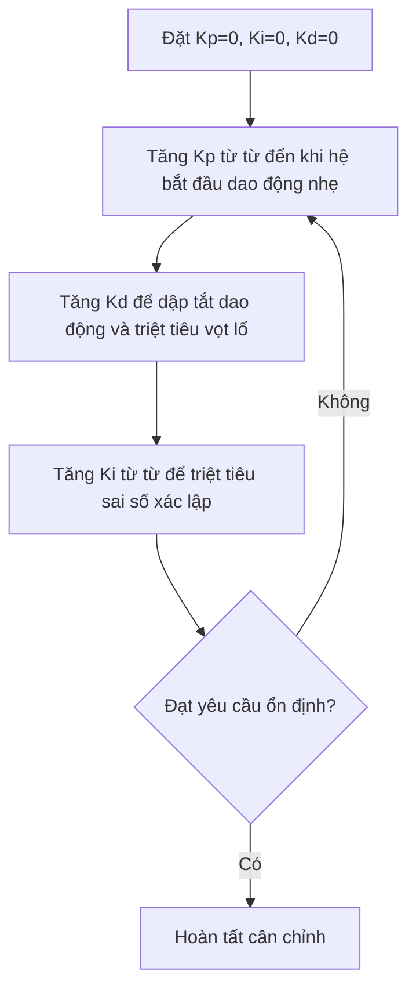

# 🎯 Bộ Điều Khiển PID (PID Controller)

Thuật toán hồi tiếp vòng kín kinh điển gồm 3 khâu: Tỷ lệ (P), Tích phân (I) và Vi phân (D).

---

## 1. Phương trình vi phân liên tục

$$
u(t) = K_p e(t) + K_i \int_{0}^{t} e(\tau) d\tau + K_d \frac{de(t)}{dt}
$$

* $K_p$ - **Proportional:** Phản ứng với sai số hiện tại. Tăng $K_p$ giúp hệ thống phản hồi nhanh nhưng dễ vọt lố (overshoot) và dao động.
* $K_i$ - **Integral:** Loại bỏ sai số xác lập (steady-state error). Dễ gây hiện tượng tích lũy sai số quá mức (Windup).
* $K_d$ - **Derivative:** Dự đoán xu hướng thay đổi sai số, tạo lực cản dập tắt dao động và ổn định hệ thống.

---

## 2. Rời rạc hóa thuật toán (Discrete Form)

Để thực thi trên vi điều khiển theo chu kỳ lấy mẫu $T_s$:

1. **Khâu Tỷ lệ:**

$$
P(k) = K_p \cdot e(k)
$$

2. **Khâu Tích phân (Xấp xỉ Euler):**

$$
I(k) = I(k-1) + K_i \cdot e(k) \cdot T_s
$$

3. **Khâu Vi phân:**

$$
D(k) = K_d \cdot \frac{e(k) - e(k-1)}{T_s}
$$

4. **Tổng tín hiệu điều khiển:**

$$
u(k) = P(k) + I(k) + D(k)
$$

---

## 3. Mã nguồn C/C++ (Kèm Anti-windup & Output Clamping)

```c
typedef struct {
    float Kp, Ki, Kd;
    float integral;
    float prev_error;
    float out_min;
    float out_max;
} PID_Controller;

void PID_Init(PID_Controller *pid, float kp, float ki, float kd, float min, float max) {
    pid->Kp = kp;
    pid->Ki = ki;
    pid->Kd = kd;
    pid->integral = 0.0f;
    pid->prev_error = 0.0f;
    pid->out_min = min;
    pid->out_max = max;
}

float PID_Compute(PID_Controller *pid, float setpoint, float feedback, float dt) {
    float error = setpoint - feedback;

    // 1. Proportional term
    float p_term = pid->Kp * error;

    // 2. Integral term with Anti-windup clamping
    pid->integral += error * dt;
    float i_term = pid->Ki * pid->integral;

    // 3. Derivative term
    float derivative = (error - pid->prev_error) / dt;
    float d_term = pid->Kd * derivative;

    // 4. Output sum
    float output = p_term + i_term + d_term;

    // Saturation Clamping
    if (output > pid->out_max) {
        output = pid->out_max;
    } else if (output < pid->out_min) {
        output = pid->out_min;
    }

    pid->prev_error = error;
    return output;
}

---
## 4. Quy trình cân chỉnh tham số (Tuning Heuristics)


````[cite: 10]

*(Lưu ý: Ở file `PID_Control.md` hoàn chỉnh tôi đã gửi sẵn trong ô mã ở phản hồi trước, đoạn này đã được bọc sẵn cú pháp ```mermaid rồi, nếu bạn copy toàn bộ từ ô đó thì không cần phải dán lẻ nữa).*