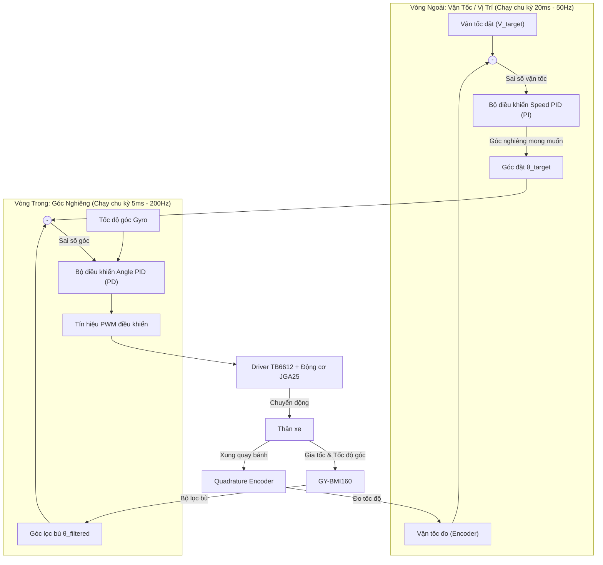
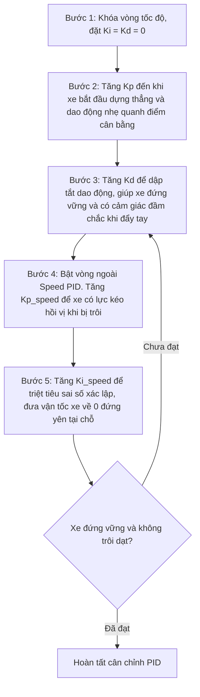

# 🎛️ Thuật Toán Điều Khiển PID Cho Xe Hai Bánh Tự Cân Bằng

Tài liệu chi tiết về cơ sở toán học, kỹ thuật rời rạc hóa, cấu trúc điều khiển lồng kép (Cascade PID) và phương pháp cân chỉnh thực nghiệm cho Robot hai bánh tự cân bằng sử dụng vi điều khiển **STM32F103C8T6**.

---

## 1. Cơ sở lý thuyết liên tục (Continuous Domain)

Bộ điều khiển **PID** (Proportional - Integral - Derivative) là thuật toán hồi tiếp vòng kín kinh điển. Tín hiệu điều khiển $u(t)$ được tính toán dựa trên sai số $e(t)$ giữa giá trị đặt (Setpoint - $r(t)$) và giá trị phản hồi đo được (Process Variable - $y(t)$):

$$e(t) = r(t) - y(t)$$

Phương trình vi phân tổng quát:

$$u(t) = K_p \, e(t) + K_i \int_{0}^{t} e(\tau) \, d\tau + K_d \, \frac{de(t)}{dt}$$

Trong đó:
* **$K_p$ (Proportional Gain):** Khâu tỷ lệ. Tác động tỷ lệ thuận với sai số hiện tại.
  * *Tác dụng:* Tăng $K_p$ giúp hệ thống phản ứng nhanh, sinh lực kéo mạnh để đưa xe về phương thẳng đứng.
  * *Hạn chế:* $K_p$ quá lớn sẽ gây vọt lố (overshoot), dao động mạnh và mất ổn định.
* **$K_i$ (Integral Gain):** Khâu tích phân. Tích lũy sai số trong quá khứ theo thời gian.
  * *Tác dụng:* Triệt tiêu sai số xác lập (steady-state error), giúp xe không bị trôi nghiêng do lệch trọng tâm.
  * *Hạn chế:* Làm chậm đáp ứng pha, dễ gây hiện tượng bão hòa tích phân (Integral Windup).
* **$K_d$ (Derivative Gain):** Khâu vi phân. Dự đoán xu hướng thay đổi sai số trong tương lai qua tốc độ biến thiên.
  * *Tác dụng:* Đóng vai trò như bộ giảm chấn ảo (damping factor), dập tắt các dao động rung lắc, giúp hệ thống ổn định và mượt mà.
  * *Hạn chế:* Rất nhạy với nhiễu đo lường tần số cao từ cảm biến.

---

## 2. Rời rạc hóa thuật toán trên Vi điều khiển (Discrete PID)

Để thực thi trên STM32 trong vòng lặp ngắt định thời với chu kỳ lấy mẫu $\Delta t$ ($T_s$):

Giả sử tại bước lặp thứ $k$:
* Sai số hiện tại: $e(k) = \text{setpoint}(k) - \text{measured}(k)$
* Khoảng thời gian lấy mẫu: $\Delta t = t_k - t_{k-1}$

### 2.1. Khâu Tỷ lệ (Proportional)
$$P(k) = K_p \cdot e(k)$$

### 2.2. Khâu Tích phân (Integral - Xấp xỉ Euler lùi)
$$I(k) = I(k-1) + K_i \cdot e(k) \cdot \Delta t$$

### 2.3. Khâu Vi phân (Derivative)
* **Phương pháp vi phân sai số:**
  $$D(k) = K_d \cdot \frac{e(k) - e(k-1)}{\Delta t}$$
* **Phương pháp tối ưu cho xe cân bằng (Derivative on Measurement):**
  Trong xe cân bằng, sai số góc $e(k) = \theta_{setpoint} - \theta(k)$. Khi thay đổi setpoint đột ngột, việc vi phân sai số sẽ sinh ra xung kích (Derivative Kick). Thay vào đó, ta sử dụng trực tiếp tốc độ góc con quay hồi chuyển $\omega_{gyro}$ thu thập từ BMI160:
  $$D(k) = -K_d \cdot \omega_{gyro}(k)$$
  *Cách làm này loại bỏ hoàn toàn nhiễu sai phân số và cho phản hồi giảm chấn tức thời, mượt mà.*

### 2.4. Tín hiệu đầu ra tổng
$$u(k) = P(k) + I(k) + D(k)$$

---

## 3. Các kỹ thuật tối ưu bắt buộc trong thực tế

### 3.1. Chống bão hòa tích phân (Anti-windup)
Khi cơ cấu chấp hành (động cơ / PWM) đạt giới hạn bão hòa (ví dụ: duty cycle = 100%), nếu sai số vẫn tồn tại, thành phần tích phân sẽ tiếp tục tăng lũy kế đến giá trị khổng lồ. Khi sai số đảo chiều, hệ thống sẽ mất nhiều thời gian để "xả" lượng tích phân này, gây vọt lố nghiêm trọng:

```c
// Giới hạn giá trị khâu tích phân (Integral Clamping)
if (pid->integral > pid->integral_max) {
    pid->integral = pid->integral_max;
} else if (pid->integral < -pid->integral_max) {
    pid->integral = -pid->integral_max;
}
```

### 3.2. Giới hạn tín hiệu điều khiển (Output Clamping)
Tín hiệu điều khiển phải được giới hạn tương ứng với dải giá trị PWM phần cứng hỗ trợ (ví dụ timer STM32 từ `-1000` đến `+1000`):

```c
if (output > pid->out_max) output = pid->out_max;
else if (output < pid->out_min) output = pid->out_min;
```

---

## 4. Kiến trúc điều khiển lồng kép (Cascade Dual-Loop Control)

Xe hai bánh tự cân bằng là hệ thống phi tuyến, bất ổn định dạng con lắc ngược (Inverted Pendulum). Một vòng PID đơn lẻ không thể vừa giữ xe đứng thẳng vừa kiểm soát được vị trí hay vận tốc của xe. Do đó, hệ thống sử dụng **Cấu trúc điều khiển phân tầng (Cascade Loop)**:


```mermaid
flowchart TD
    subgraph Vòng_Vận_Tốc ["Vòng Ngoài: Vận Tốc / Vị Trí (Chạy chu kỳ 20ms - 50Hz)"]
        V_ref["Vận tốc đặt (V_target)"] --> Sum_V(("-"))
        V_fb["Vận tốc đo (Encoder)"] --> Sum_V
        Sum_V -->|Sai số vận tốc| PID_Speed["Bộ điều khiển Speed PID (PI)"]
        PID_Speed -->|Góc nghiêng mong muốn| Theta_ref["Góc đặt θ_target"]
    end

    subgraph Vòng_Cân_Bằng ["Vòng Trong: Góc Nghiêng (Chạy chu kỳ 5ms - 200Hz)"]
        Theta_ref --> Sum_A(("-"))
        Theta_fb["Góc lọc bù θ_filtered"] --> Sum_A
        Sum_A -->|Sai số góc| PID_Angle["Bộ điều khiển Angle PID (PD)"]
        Gyro["Tốc độ góc Gyro"] --> PID_Angle
        PID_Angle --> PWM_out["Tín hiệu PWM điều khiển"]
    end

    PWM_out --> Plant["Driver TB6612 + Động cơ JGA25"]
    Plant -->|Chuyển động| Xe["Thân xe"]
    Xe -->|Gia tốc & Tốc độ góc| IMU["GY-BMI160"]
    Xe -->|Xung quay bánh| Enc["Quadrature Encoder"]
    IMU -->|Bộ lọc bù| Theta_fb
    Enc -->|Đo tốc độ| V_fb
```

### Chi tiết 2 vòng lặp:
1. **Vòng lặp trong (Angle Loop - Cân bằng góc):**
   * **Mục tiêu:** Giữ thân xe cân bằng thẳng đứng.
   * **Chu kỳ thực thi:** Rất nhanh ($5\text{ms} \div 10\text{ms}$, tương đương $100\text{Hz} \div 200\text{Hz}$).
   * **Thuật toán:** Thường sử dụng **PD (Proportional - Derivative)**.
   * **Lưu ý:** Không nên dùng khâu $I$ trong vòng cân bằng vì tính trễ pha của tích phân dễ làm xe rung lắc và mất cân bằng.
2. **Vòng lặp ngoài (Speed Loop - Vận tốc/Vị trí):**
   * **Mục tiêu:** Giữ xe đứng yên tại chỗ hoặc di chuyển theo lệnh điều khiển tiến/lùi, triệt tiêu vận tốc trôi.
   * **Chu kỳ thực thi:** Chậm hơn ($20\text{ms} \div 50\text{ms}$, tương đương $20\text{Hz} \div 50\text{Hz}$).
   * **Thuật toán:** Thường sử dụng **PI (Proportional - Integral)** để đưa vận tốc trung bình về 0.
   * **Đầu ra:** Xuất ra một góc nghiêng bù trừ ($\theta_{target}$). Nếu xe có xu hướng trôi về phía trước, vòng ngoài yêu cầu xe ngả về sau để hãm lại.

---

## 5. Mã nguồn C chuẩn Module hóa cho STM32

### Khai báo cấu trúc PID (`pid.h`):

```c
#ifndef PID_H
#define PID_H

#include <stdint.h>

typedef struct {
    float Kp;             // Hệ số tỉ lệ
    float Ki;             // Hệ số tích phân
    float Kd;             // Hệ số vi phân

    float integral;       // Biến tích lũy tích phân
    float integral_max;   // Giới hạn chống tràn tích phân (Anti-windup)
    
    float prev_error;     // Sai số ở bước trước
    float prev_measured;  // Giá trị đo ở bước trước

    float out_min;        // Giới hạn bão hòa dưới
    float out_max;        // Giới hạn bão hòa trên
} PID_Controller_t;

void PID_Init(PID_Controller_t *pid, float kp, float ki, float kd, 
              float integral_max, float out_min, float out_max);
void PID_Reset(PID_Controller_t *pid);
float PID_Compute(PID_Controller_t *pid, float setpoint, float measured, float dt);
float PID_Angle_Compute(PID_Controller_t *pid, float angle_setpoint, 
                        float angle_measured, float gyro_rate);

#endif
```

### Cài đặt thuật toán (`pid.c`):

```c
#include "pid.h"

void PID_Init(PID_Controller_t *pid, float kp, float ki, float kd, 
              float integral_max, float out_min, float out_max) {
    pid->Kp = kp;
    pid->Ki = ki;
    pid->Kd = kd;
    pid->integral = 0.0f;
    pid->integral_max = integral_max;
    pid->prev_error = 0.0f;
    pid->prev_measured = 0.0f;
    pid->out_min = out_min;
    pid->out_max = out_max;
}

void PID_Reset(PID_Controller_t *pid) {
    pid->integral = 0.0f;
    pid->prev_error = 0.0f;
    pid->prev_measured = 0.0f;
}

// Hàm tính toán tổng quát (Dùng cho vòng ngoài: Speed PID)
float PID_Compute(PID_Controller_t *pid, float setpoint, float measured, float dt) {
    float error = setpoint - measured;

    // 1. Khâu tỉ lệ
    float p_term = pid->Kp * error;

    // 2. Khâu tích phân kèm Anti-windup
    pid->integral += error * dt;
    if (pid->integral > pid->integral_max) pid->integral = pid->integral_max;
    else if (pid->integral < -pid->integral_max) pid->integral = -pid->integral_max;
    float i_term = pid->Ki * pid->integral;

    // 3. Khâu vi phân
    float derivative = (dt > 0.0f) ? ((error - pid->prev_error) / dt) : 0.0f;
    float d_term = pid->Kd * derivative;
    pid->prev_error = error;

    // 4. Tổng đầu ra và kẹp biên
    float output = p_term + i_term + d_term;
    if (output > pid->out_max) output = pid->out_max;
    else if (output < pid->out_min) output = pid->out_min;

    return output;
}

// Hàm tính toán chuyên biệt cho vòng trong (Angle Loop) dùng trực tiếp Gyro Rate
float PID_Angle_Compute(PID_Controller_t *pid, float angle_setpoint, 
                        float angle_measured, float gyro_rate) {
    float error = angle_setpoint - angle_measured;

    // 1. Khâu tỉ lệ (Phản ứng theo góc nghiêng)
    float p_term = pid->Kp * error;

    // 2. Khâu vi phân (Trực tiếp từ cảm biến Gyroscope, không bị nhiễu sai phân số)
    float d_term = -pid->Kd * gyro_rate;

    // 3. Khâu tích phân (nếu sử dụng)
    float i_term = pid->Ki * pid->integral;

    float output = p_term + i_term + d_term;
    if (output > pid->out_max) output = pid->out_max;
    else if (output < pid->out_min) output = pid->out_min;

    return output;
}
```

---

## 6. Quy trình cân chỉnh tham số thực nghiệm (Tuning Guide)


```mermaid
graph TD
    Step1["Bước 1: Khóa vòng tốc độ, đặt Ki = Kd = 0"] --> Step2["Bước 2: Tăng Kp đến khi xe bắt đầu dựng thẳng và dao động nhẹ quanh điểm cân bằng"]
    Step2 --> Step3["Bước 3: Tăng Kd để dập tắt dao động, giúp xe đứng vững và có cảm giác đầm chắc khi đẩy tay"]
    Step3 --> Step4["Bước 4: Bật vòng ngoài Speed PID. Tăng Kp_speed để xe có lực kéo hồi vị khi bị trôi"]
    Step4 --> Step5["Bước 5: Tăng Ki_speed để triệt tiêu sai số xác lập, đưa vận tốc xe về 0 đứng yên tại chỗ"]
    Step5 --> Step6{"Xe đứng vững và không trôi dạt?"}
    Step6 -- Chưa đạt --> Step3
    Step6 -- Đã đạt --> Done["Hoàn tất cân chỉnh PID"]
```

1. **Hiệu chỉnh điểm không cơ học (Mechanical Zero Offset):**
   * Do trọng tâm thực tế của xe không bao giờ nằm chính xác $0^\circ$ góc cảm biến, hãy tìm góc $\theta_0$ mà xe có thể tự đứng cân bằng tự nhiên mà không cần cấp nguồn động cơ.
2. **Cân chỉnh vòng góc (Angle PID - Vòng trong):**
   * Đặt toàn bộ hệ số khác bằng 0.
   * Tăng $K_{p\_angle}$ dần từ nhỏ đến khi xe có thể tự phản ứng dựng thẳng nhưng vẫn lắc qua lắc lại quanh điểm cân bằng.
   * Tăng $K_{d\_angle}$ dần để hấp thụ dao động. Khi chỉnh đúng, nếu dùng ngón tay đẩy nhẹ vào thân xe, bạn sẽ thấy lực cản phản kháng đàn hồi và xe trở lại vị trí thẳng đứng ngay lập tức mà không bị rung giật.
3. **Cân chỉnh vòng tốc độ (Speed PID - Vòng ngoài):**
   * Sau khi vòng góc đã ổn định, kích hoạt vòng vận tốc.
   * Tăng $K_{p\_speed}$ để khi xe bắt đầu trôi về phía trước, bánh xe sẽ tăng tốc vượt lên trước để tạo góc nghiêng ngả sau hãm lại.
   * Tăng $K_{i\_speed}$ để loại bỏ hiện tượng trôi dạt cố định theo một hướng, giữ xe nằm yên trong một diện tích nhỏ.
